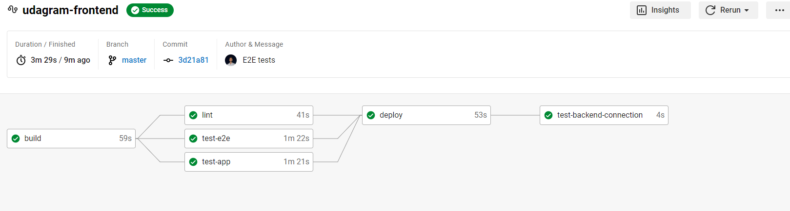

# Udgram Frontend

## Pipeline status: 

## Required Environment Variables
| Environment Variable        | Description                                                                      |
|         :-:                 |     :-:                                                                          |
| WEB_SERVER_DNS              | Loadbalancer URL (from cloudformation outputs `WebServerDNS`)                    | 
| FRONTEND_BUCKET_NAME        | Frontend bucket name (from cloudformation outputs `FrontEndBucket`)              | 

Features:
-	Using private S3 bucket to host the Angular.js frontend
-	Three types of tests:
    -	Automated Selenium tests to mimic user clicks and actions
    -	Lint the application code
    -	Test the creation of the UI of the webpages
-	Finally the pipeline doesn’t succeed unless the backend is up and running and the connection is working properly.

